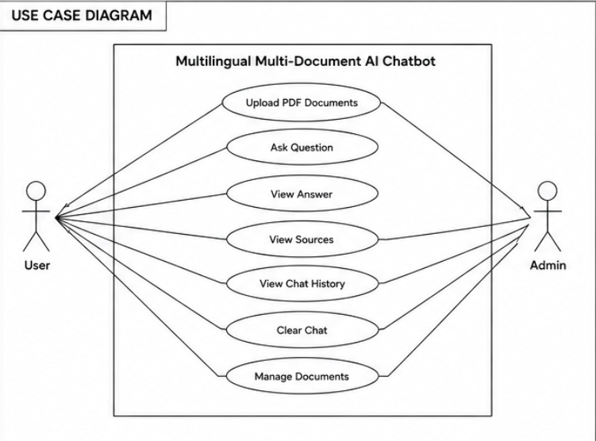

# 📚 Multilingual Multi-Document AI Chatbot

An AI-powered multilingual chatbot that enables users to interact with multiple PDF documents through natural language queries. The system leverages OCR, Retrieval-Augmented Generation (RAG), FAISS vector search, Groq LLM, and MySQL to deliver accurate, source-aware responses across multiple languages.

---

## 🚀 Key Features

- 📄 Multi-PDF Question Answering
- 🔍 OCR Support for Scanned PDFs
- 🌍 Multilingual Query & Response Support
- 🧠 Query Rewriting for Better Retrieval
- 📚 Retrieval-Augmented Generation (RAG)
- ⚡ FAISS Semantic Search
- 🤖 Groq LLM Integration
- 📌 Source-Aware Responses with Citations
- 🗄️ MySQL Chat History Storage
- 💬 Interactive Streamlit Interface

---

## 📸 Application Preview

### Home Page


### PDF Upload & Processing


### Chat Response with Sources


### MySQL Chat History Storage


---

## 📊 UML Diagrams

### Use Case Diagram



### Class Diagram


### Sequence Diagram


### Component Diagram


---

## 🔄 System Workflow

```text
User Query
    ↓
Language Detection
    ↓
Translate to English
    ↓
Query Rewriting
    ↓
FAISS Retrieval
    ↓
Groq LLM Answer Generation
    ↓
Response Translation
    ↓
Source Citation
    ↓
Store Chat History in MySQL
```

---

## 🏗️ System Architecture

```text
PDF Documents
      │
      ▼
PDF Loader
      │
      ▼
OCR Extraction
      │
      ▼
Document Chunking
      │
      ▼
Embedding Generation
      │
      ▼
FAISS Vector Store
      │
      ▼
Retriever
      │
      ▼
RAG Pipeline
      │
      ▼
Groq LLM
      │
      ▼
Response Generation
      │
      ▼
Translation Layer
      │
      ▼
MySQL Storage
```

---

## 🛠️ Tech Stack

| Category | Technology |
|-----------|-----------|
| Frontend | Streamlit |
| Backend | Python |
| Framework | LangChain |
| LLM | Groq |
| Embeddings | HuggingFace Sentence Transformers |
| Vector Database | FAISS |
| OCR | Tesseract OCR |
| Database | MySQL |
| PDF Processing | PyMuPDF |
| Translation | Google Translator |
| Language Detection | LangDetect |

---

## 📂 Project Structure

```text
multilingual-chatbot/
│
├── app.py
├── db.py
├── requirements.txt
│
├── utils/
│   ├── pdf_loader.py
│   ├── embeddings.py
│   ├── rag_chain.py
│   ├── translator.py
│   └── rewriter.py
│
├── images/
│   ├── homepage.png
│   ├── upload.png
│   ├── answers.png
│   ├── mysql.png
│   ├── usecase_diagram.png
│   ├── class_diagram.png
│   ├── sequence_diagram.png
│   └── component_diagram.png
│
└── README.md
```

---

## 🎯 Challenges Solved

- Extracting text from scanned PDFs using OCR
- Supporting multilingual user interactions
- Improving retrieval quality through query rewriting
- Performing semantic search using FAISS embeddings
- Generating source-aware responses
- Maintaining persistent chat history using MySQL
- Processing and querying multiple documents simultaneously

---

## ⚙️ Installation

### Clone Repository

```bash
git clone https://github.com/<username>/multilingual-chatbot.git
```

### Navigate to Project

```bash
cd multilingual-chatbot
```

### Create Virtual Environment

```bash
python -m venv venv
```

### Activate Environment

```bash
venv\Scripts\activate
```

### Install Dependencies

```bash
pip install -r requirements.txt
```

### Run Application

```bash
streamlit run app.py
```

---

## 🔮 Future Enhancements

- User Authentication
- Session-Based Chat History
- Voice-Based Queries
- Conversation Memory
- Feedback & Rating System
- Cloud Deployment
- Document Summarization
- Hybrid Search (Keyword + Semantic)

---

## 👩‍💻 Contributors

- Sukruti Naidu
- Navya Pachigolla

---

## ⭐ Support

If you found this project useful:

- ⭐ Star the repository
- 🍴 Fork the repository
- 🤝 Contribute to the project

---

## 📜 License

This project is intended for educational, research, and learning purposes.