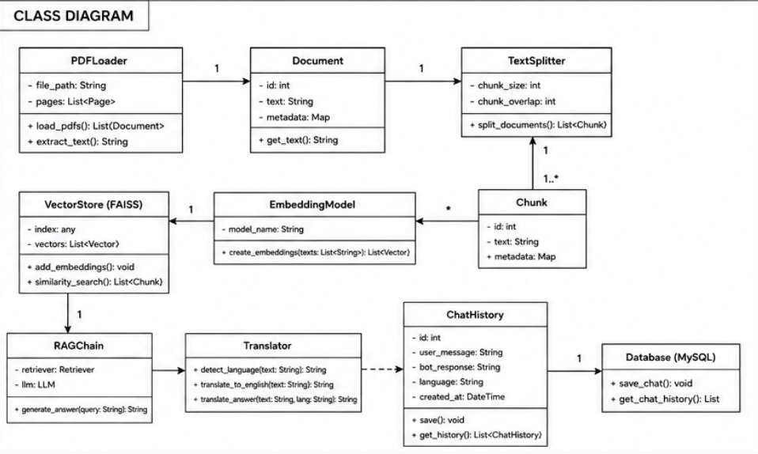
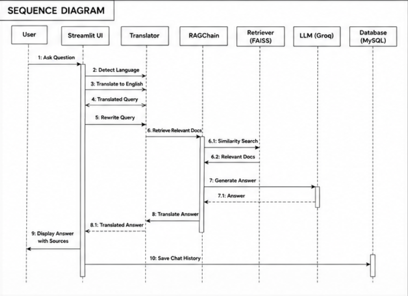
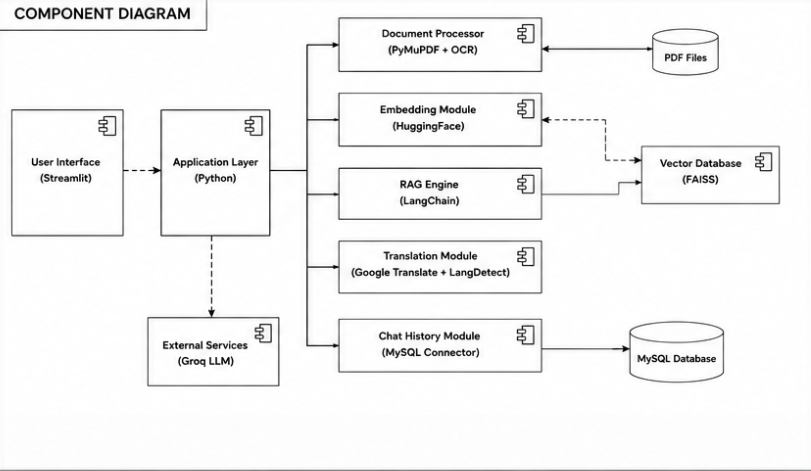

# 📚 Multilingual Multi-Document AI Chatbot

An AI-powered multilingual chatbot that answers questions from multiple PDF documents using OCR, Retrieval-Augmented Generation (RAG), FAISS vector search, Groq LLM, and MySQL-powered chat history storage.

---

## 🚀 Key Features

- 📄 Multi-PDF Question Answering
- 🔍 OCR Support for Scanned PDFs
- 🌍 Multilingual Query & Response Support
- 🧠 Query Rewriting for Better Retrieval
- 📚 Retrieval-Augmented Generation (RAG)
- ⚡ FAISS Semantic Search
- 🤖 Groq LLM Integration
- 📌 Source-Aware Responses
- 🗄️ MySQL Chat History Storage
- 💬 Interactive Streamlit Interface

---

## 📸 Application Preview

### Home Page


### PDF Upload & Processing


### Chat Response with Sources


### MySQL Chat History Storage


---

## 📊 UML Diagrams

### Use Case Diagram


### Class Diagram



### Sequence Diagram



### Component Diagram



---

## 🔄 System Workflow

```text
User Query
    ↓
Language Detection
    ↓
Translation to English
    ↓
Query Rewriting
    ↓
FAISS Retrieval
    ↓
Groq LLM Answer Generation
    ↓
Response Translation
    ↓
Source Citation
    ↓
MySQL Chat Storage
```

---

## 🏗️ Tech Stack

| Category | Technology |
|-----------|-----------|
| Frontend | Streamlit |
| Backend | Python |
| LLM | Groq |
| Framework | LangChain |
| Embeddings | HuggingFace |
| Vector Database | FAISS |
| OCR | Tesseract OCR |
| Database | MySQL |
| PDF Processing | PyMuPDF |
| Translation | Google Translator |

---

## 📂 Project Structure

```text
multilingual-chatbot/
│
├── app.py
├── db.py
├── requirements.txt
│
├── utils/
│   ├── pdf_loader.py
│   ├── embeddings.py
│   ├── rag_chain.py
│   ├── translator.py
│   └── rewriter.py
│
├── images/
│
└── README.md
```

---

## 🎯 Challenges Solved

- Extracting text from scanned PDFs using OCR
- Handling multilingual user queries
- Improving retrieval through query rewriting
- Generating source-aware responses
- Storing conversation history using MySQL
- Retrieving information across multiple documents

---

## ⚙️ Installation

```bash
git clone <repository-url>

cd multilingual-chatbot

python -m venv venv

venv\Scripts\activate

pip install -r requirements.txt

streamlit run app.py
```

---

## 🔮 Future Enhancements

- User Authentication
- Session-Based Chat History
- Feedback System
- Voice-Based Queries
- Conversation Memory
- Cloud Deployment

---

## 👩‍💻 Contributors

- Sukruti Naidu
- Navya Pachigolla

---

## ⭐ Support

If you found this project useful:

- Star the repository
- Fork the repository
- Contribute to the project